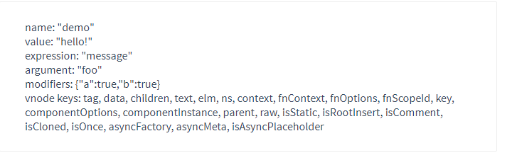

# Vue知识点总结

## 1.什么时MVVM
MVVM就是Model-View-ViewModel的缩写。Model代表数据模型，定义数据修改和逻辑操作，View代表UI组件，负责将数据转化成UI展示出来。ViewModel就是一个同步Model和View的对象。
在MVVM架构下，View和Model通过ViewModel进行交互。ViewModel通过双向数据绑定把View和Model链接起来。

## 2.mvvm和mvc区别？和其他框架（jQuery）的区别是什么？哪些场景适合？
mvc和mvvm区别不大。都是一种设计思想。主要就是把mvc中的Control演变成mvvm中的viewModel。mvvm主要解决mvc中大量的DOM操作使页面渲染性能降低，加载速度变慢，影响用户体验。
区别：vue数据驱动，通过数据来显示视图层而不是节点操作。
场景：数据操作比较多得场景，更加便捷。

## 3.组件间的传值
+ 父组件与子组件传值
    - 父组件通过标签上面定义值
    - 子组件通过props方法接收数据
+ 子组件向父组件传递数据
    - 子组件通过`$emit`方法传递参数

## 4.Vue的双向绑定原理
mvvm双向绑定，采用`数据劫持`结合发布者订阅者模式的方式，通过Object.defineProperty()来劫持各个属性的setter和getter，在数据变动时发布者发布消息给订阅者，触发相应的监听回调。（Vue3采用的Proxy代理的模式代理数据，和Object.defineProperty的方式不同的是，Proxy可以直接代理整个对象（或者单值），而不用递归）

* 几个要点：
    1. 实现一个数据监听器Observer，能够对数据对象的所有属性进行监听，如有变动可拿到最新的值并通知订阅者。
    2. 实现一个指令解析器Compile，对每个元素节点的指令进行扫描和解析，根据指令模板替换数据以及绑定相应的更新函数
    3. 实现一个Watcher，作为连接Observer和Compile的桥梁，能够订阅并收到每个属性变动的通知，执行指令函数的相应对调函数，从而更新视图
    4. mvvm的入口函数，整合三者

* 具体实现步骤：
+ 需要observer的数据对象进行递归遍历，包括子属性的对象属性，都加上setter和getter，这样的话，给这个对象的某个值赋值，就会触发setter，那么就能监听到数据的变化了。
+ compile解析模板指令，将模板中的变量替换成数据，然后初始化渲染页面视图，并将每个指令对应的节点绑定更新函数，添加监听数据的订阅者，一旦数据有变动，收到通知更新视图。
+ Watcher订阅者是observer和compile的通信桥梁，主要做的事情就是在自身实例化的时候往属性订阅器（dep）中添加自己，自身必须有一个update()方法，待属性变动dep.notice()通知时，能调用自身的update方法，并触发compile中绑定的回调，则功成身退。
+ mvvm作为数据绑定的入口，整合observer、compile和watcher三者。通过observer来监听自己的model数据变化，通过compile来解析编译模板指令，最终利用watcher搭起observer和compile之间的通信桥梁，达到数据变化->视图更新；视图交互变化->数据model变更的双向绑定效果。

## 5.描述一下vue从初始化页面-修改数据-刷新页面UI的过程
当vue进入初始化阶段时，一方面vue会遍历data中的属性，并用Object.defineProperty将它转化程getter/setter的形式，实现数据劫持（vue3.0开始是使用的Proxy代理）；另一方面，vue的指令编译器Compiler对元素节点的各个指令进行解析，初始化试图，并订阅Watcher来更新视图，此时Watcher会将自己添加到消息订阅器Dep中，此时初始化完毕。
当数据发成变化时，出发Observer中的setter方法，立即调用Dep.notify()，Dep这个数组开始遍历所有的订阅者，并调用其update方法，vue内部再通过diff算法，patch相应的更新完成对订阅者视图的改变。

## 6.你是如何理解Vue的响应式系统？
+ 任何一个Vue Component都有一个与之对应的Watcher实例
+ Vue的data上的属性会被添加getter和setter属性
+ 当Vue Component render函数被执行的时候，data上被触碰，即被读，getter方法会被调用，此时Vue会去记录此Vue Component所依赖的所有data属性，这一过程被称为依赖收集
+ data被改动时，即被写，setter方法会被调用，此时vue会去通知所有依赖于此data的组件去调用他们的render函数进行更新

## 7.虚拟DOM实现原理
+ 虚拟DOM本质是Javascript对象，是对真实DOM的抽象
+ 状态变更时，记录新树和旧树的差异
+ 最后把差异更新到真正的DOM

## 8.Vue中key值的作用
当Vue.js用v-for正在更新已经渲染过的元素列表时，它默认使用“就地复用”的策略。如果数据项的顺序被改变了，Vue将不会移动DOM来匹配数据项的顺序，而是简单复用此处的每个元素，并确保它在特定索引下显示已被渲染过的每个元素。key的作用主要是为了高效地更新虚拟DOM。（在数据列表顺序改变时，key查找更新更加高效）

## 9.Vue的生命周期函数
**Vue2.0**总共分为8个阶段：创建前/后，载入前/后，更新前/后，销毁前/后。
+ 创建前后：
    + beforeCreate：在此阶段，vue实例的挂载元素el和数据对象data都为undefined，还未初始化。
    + created：在此阶段，vue实例对象的数据data有了，el还没有。
+ 载入前后：；
    + beforeMount：在此阶段，vue的实例的$el和data都初始化了，但是还是挂载之前为虚拟dom节点，data.message还未被替换。
    + mounted：在此阶段，vue实例挂载完成，data.message成功渲染。
+ 更新前后：
    + beforeUpdate：在此阶段，当data变化时，会触发beforeUpdate和updated方法
    + updated：在此阶段，当data变化时，会触发beforeUpdate和updated方法
+ 销毁前后：（beforeDestroy/destroyed）
    + 在执行destory方法后，对data的改变不会再触发周期函数，说明此时vue实例已经解除了事件监听以及dom的绑定，但是dom结构依然存在。

**Vue3.0** 将2.0中的beforeCreate和created合并到setup函数中，其余部分在原基础的前方加入“on”前缀，使用驼峰命名法：
+ beforeCreate -> setup
+ created      -> setup
+ beforeMount  -> onBeforeMount
+ mounted      -> onMounted
+ beforeUpdate -> onBeforeUpdate
+ updated      -> onUpdated
+ beforeDestroy-> onBeforeDestroy
+ destroyed    -> onDestroyed

**9.1 什么是生命周期函数**
Vue实例从创建到销毁的过程，就是生命周期，也就是从开始创建、初始化数据、编译模板、挂载DOM->渲染、更新->渲染、卸载等一系列过程，我们称之为生命周期。

**9.2 Vue生命周期的作用是什么**
它的生命周期中有多个事件钩子，让我们在控制整个Vue实例的过程时更容易形成好的逻辑

**9.3 第一次页面加载会触发哪几个钩子**
第一次页面加载时会触发beforeCreate、created、beforeMount、mounted这几个钩子

**9.4 DOM渲染在哪个周期中完成**
DOM渲染在mounted中就已经完成了

**9.5 简单描述每个周期具体适合哪些场景**
+ beforeCreate：可以在这个加上loading事件，在加载实例时触发
+ created：初始化完成时的事件写在这里，如在这结束loading事件，异步请求也适宜在这里调用
+ mounted：挂载元素，获取DOM节点
+ updated：如果对数据统一处理，在这里写上相应的函数
+ beforeDestroy：可以做一个确认停止事件的确认框，清除settimeout等
+ nextTick：更新数据后立即操作DOM（准确的说法是当更新数据，新数据作用到DOM节点上，此时DOM为新数据对应的DOM，操作新数据下的DOM节点）

## 10.Vue组件间通信有哪些方式
+ props/$emit
    - 父组件通过props，在标签上将参数传递给子组件；子组件通过$emit方式，调用其在标签上通过v-on(@)绑定的方法，然后将数据作为方法的参数传递给父组件
    ```html
    <!-- 父组件 -->
     <div>
         <Child :name="name" v-on:dataBackToParent="reciveDataFromChild"></Child>
     </div>
    ```
    ```js
        // 父组件部分代码
        import Child from 'xxx/Child.vue';

        new Vue({
            components: {
                Child,
            },
            data() {
                name: '张三'
            },
            methods: {
                reciveDataFromChild(data) {
                    console.log(data); // 这里的data就是子组件Child通过$emit(dataBackToParent)返回的数据
                }
            }
        });

        
        // 子组件js部分代码
        new Vue({
            ...
            props: {
                name: {
                    type: String, // 类型
                    value: '', // 默认值
                }
            },
            mounted() {
                ...
                this.$emit('dataBackToParent', {age: 18});
            }
        });


        // Vue3.0的props和emit，在setup函数中以参数的形式
        setup(props, { emit }) {
            // 这里的props就是父组件传递过来的参数，
            // emit('事件名称', 数据)
        }
    ```
+ $emit/$on
+ vuex
+ $attr/$listener
+ provide/inject
+ $parent/$child与ref

## 11.Vue3中的ref


## 12.Vue中怎么重置data
使用Object.assign()，vm.$data可以获取当前状态下的data，vm.$options.data(this)可以获取到组件初始状态下的data。
```js
Object.assign(this.$data, this.$options.data(this)) // 注意加this
```

## 13.组件中写name选项有什么用
+ 项目使用keep-alive时，可搭配组件name进行缓存
```html
    <template>
        <keep-alive>
            <!-- 这里表示home组件会被缓存 -->
            <router-view include="home"/>    
        <keep-alive>
    </template>
```
+ DOM做递归组件时需要调用自身的name
    - 此处展示一个例子：注意，利用name属性，使用条件编译v-if，设置好限制条件，不能无限递归
    ```vue
    <!--menu组件-->
    <template>
        <ul>
            <li v-for="(item, index) in listData">
                <span @click="handle(item)">{{item.title}}</span>
                <v-menu :listData="item.children" v-if="item.children" v-show="item.flag"></v-menu>
            </li>
        </ul>
    </template>
    <script>
        import VMenu from './VMenu';
        export.default {
            name: 'VMenu',
            components: {
                VMenu,
            },
            props: ['listData'],
            methods: {
                handle(item) {
                    return item.flag = !item.flag
                }
            }
        }
    </script>
    ```
    ```vue
    <!--父组件-->
    <template>
        <div id="app">
            <v-menu :listData="listData"></v-menu>
        </div>
    </template>
    <script>
        import VMenu from './VMenu';
        export.default {
            components: {
                VMenu,
            },
            data() {
                return {
                    listData: [
                        {
                            title: '一级菜单',
                            flag: true,
                            children: [
                                {
                                    title: '二级菜单',
                                    flag: true,
                                    children: [
                                        {
                                            title: '三级菜单'
                                        }
                                    ]
                                },
                                {
                                    title: '二级菜单'
                                },{
                                    title: '二级菜单'
                                }
                            ]
                        },
                        {
                            title: '一级菜单',
                            children: [
                                {
                                    title: '二级菜单',
                                    flag: true
                                }
                            ]
                        },
                        {
                            title: '一级菜单'
                        }
                    ]
                }
            }
        }
    </script>
    ```
    - 展示效果，可折叠

    

+ vue-devtools调试工具里显示的组件名称有vue中组件name决定

## 14.keep-alive的原理和作用
`keep-alive`是vue内置的一个组件。当我们想对某个不想频繁刷新的组件。
一般情况下，当进行组件切换时，会默认的销毁上一个组件，然后再展示下一个组件的。如果有需求某个组件切换后不进行销毁的话，这个时候就会用到`keep-alive`来实现了。
假设：当前有Home和About两个组件，希望缓存Home组件
```html
<!-- App组件 -->
<template>
    <div id="app">
        <div id="nav">
            <router-link to="/">Home</router-link>
            <router-link to="/about">About</router-link>
        </div>
        <keep-alive>
            <router-view />
        </keep-alive>
    </div>
</template>
```
这样写完之后，Home和About组件都会被缓存下来。不符合需求

**方法一：** 可以利用`keep-alive`中的`include`和`exclude`匹配组件
+ include：字符串或正则表达式。只有名称匹配的组件会被缓存
+ exclude：字符串或正则表达式。任何名称匹配的组件都不会被缓存。
```html
<!--用逗号分隔字符串，匹配到a或者b都会被缓存-->
<keep-alive include="a,b">
    <router-view />
</keep-alive>

<!--正则表达式-->
<keep-alive include="/a|b/">
    <router-view />
</keep-alive>

<!--数组，可以配合v-bind使用-->
<keep-alive :include="['a', 'b']">
    <router-view />
</keep-alive>
```

回到刚才的例子中，如果想要Home组件匹配到，则需要改变App组件写法
```html
<!-- include匹配Home组件 -->
<template>
    <div id="app">
        <div id="nav">
            <router-link to="/">Home</router-link>
            <router-link to="/about">About</router-link>
        </div>
        <keep-alive include="home">
            <router-view />
        </keep-alive>
    </div>
</template>
```

**方法二：** 利用路由规则中的meta添加keepAlive属性为true，也就是当前路由组件要进行缓存。结合v-if使用，当meta中的keepAlive为true进行缓存，否则不缓存，这样更灵活一些。
```js
// 路由对象
{
    path: '/home',
    name: 'home',
    meta: {
        keepAlive: true
    },
    component: Home
}
```
```html
<keep-alive>
    <router-view v-if="$route.meta.keepAlive" />
</keep-alive>
<router-view v-if="!$route.meta.keepAlive" />
```

**注意：** 被keep-alive缓存的组件，当切换时，因为没有被销毁，所以组件在切换时不会调用`created`等生命周期函数。这时，可以使用`actived`和`deactived`来获取当前组件是否处于活动状态。

## 15.vue-router有哪些钩子函数
+ 全局前置守卫 router.beforeEach
    - 使用`router.beforeEach`注册一个全局前置守卫
    ```js
    const router = createRouter();
    router.beforeEach((to, from) => {
        // ...
        // 返回false以取消导航
        return false
    });
    ```
    - 当一个导航被触发，全局前置守卫按照创建顺序调用。守卫时异步解析执行的，此时导航在所有守卫resolve完之前一直处于**等待**状态。
    - 每个守卫接受两个参数
        + to 即将要进入的地方
        + from 当前导航正要离开的路由
    - 守卫可以返回值如下：
        + `false`：取消当前导航，如果浏览器的url改变了（可能是用户手动输入获取浏览器返回按钮），那么url地址会重置到`from`路由对应的地址
        + 一个**路由地址**：通过一个路由地址跳转到不同的地址，就像调用`router.push`一样，还可以设置诸如`replace:true`或`name:'home'`之类的配置。当前的导航被中断，然后进行一个新的导航，就像`from`一样。
    - 如果遇到意外情况，可能会抛出一个`Error`，这回取消导航，并调用`router.onError()`注册过的回调。
    - 如果什么都没有返回，undefined或者返回true的情况，**则导肮是有效的**，并调用下一个导航守卫。
    - 以上所有都统`async`**函数**和Promise工作方式一样
    ```js
    router.beforeEach(async (to, from) => {
        // canUseAccess()，返回false或者true
        return await canUseAccess(to);
    })
    ```
    - **可选的第三个参数** `next`
    这里贴一段官方文档的解释:
    > 在之前的 Vue Router 版本中，也是可以使用 第三个参数 next 的。这是一个常见的错误来源，可以通过 RFC 来消除错误。然而，它仍然是被支持的，这意味着你可以向任何导航守卫传递第三个参数。在这种情况下，确保 next 在任何给定的导航守卫中都被严格调用一次。它可以出现多于一次，但是只能在所有的逻辑路径都不重叠的情况下，否则钩子永远都不会被解析或报错。这里有一个在用户未能验证身份时重定向到/login的错误用例：
    ```js
    // BAD
    router.beforeEach((to, from, next) => {
        if (to.name !== 'Login' && !isAuthenticated) next({ name: 'Login' })
        // 如果用户未能验证身份，则 `next` 会被调用两次
        next()
    })
    ```
    下面是正确使用方式
    ```js
    // GOOD
    router.beforeEach((to, from, next) => {
        if (to.name !== 'Login' && !isAuthenticated) next({ name: 'Login' })
        else next()
    })
    ```
+ 全局解析守卫 router.beforeResolve
    - `router.beforeResolve和router.beforeEach类似，每次导航都会触发，但是确保在导航被确认之前，**同时在所有组件内部守卫和异步路由组件被解析之后，解析守卫就被正式调用**。这里有一个例子，确保用户可以访问自定义meta属性requireCamera的路由：
    ```js
    router.beforeResolve(async to => {
        if(to.meta.requireCamera) {
            try{
                return await askForCameraPermission()
            }catch(error) {
                if(error instanceOf NotAllowedError) {
                    // ...处理错误，然后return false取消导航
                    return false;
                } else {
                    // 意料之外的错误，取消导航并把错误传给全局处理器
                    throw error;
                }
            }
        }
    })
    ```
    `router.beforeResolve`是获取数据或者执行任何其他操作（如果用户无法进入页面时你想进行的操作）的理想位置

+ 全局后置守卫 router.afterEach
    - 与守卫不同的是，`router.afterEach`不会接受next函数，不会改变导航本身
    - 它对于分析、更改页面、声明页面等辅助功能很有作用
    - 它反映了`navigation.failure`作为第三个参数
    ```js
    router.afterEach((to, from, failure) => {
        if(!failure) sendToAnynics();
    })
    ```
+ 路由独享守卫 beforeEnter
    - 可在路由配置里面定义`beforeEnter`
    ```js
    const routes = [
        {
            path: '/user/:id',
            component: UserDetails,
            beforeEnter: (to, from) => {
                // reject the navigation
                return false;
            }
        }
    ]
    ```
    - `beforeEnter`只在**进入路由**时触发，不会在`params`、`query`、`hash`改变时触发，例如下面的情况：从`user/2`进入`user/3`，或者从`user/2#info`进入`user/2#projects`。
    - 你也可以将一个**函数数组**传递给`beforeEnter`，这在为不同的路由重用守卫时很有用：
    ```js
    function removeQueryParams(to) {
        if(Object.keys(to.query).length) {
            return {path: to.path, query:{}, hash: to.hash }
        }
    }

    function removeHash(to) {
        if(to.hash) return {path: to.path, query: to.query, hash: ''};
    }

    const routes = [
        {
            path: '/user/：id',
            conponent: Userdetails,
            beforeEnter: [removeQueryParams, removeHash]
        },
        {
            path: '/about',
            component: About,
            beforeEnter: [removeHash]
        }
    ]
    ```
+ 组件内的守卫 beforeRouterEnter\beforeRouteUpdate\beforeRouteLeave
    - 官方的例子：
    ```js
    const UserDetails = {
        template: `...`,
        beforeRouteEnter(to, from) {
            // 在渲染该组件的对应路由被验证前调用
            // 不能获取组件实例 `this` ！
            // 因为当守卫执行时，组件实例还没被创建！
        },
        beforeRouteUpdate(to, from) {
            // 在当前路由改变，但是该组件被复用时调用
            // 举例来说，对于一个带有动态参数的路径 `/users/:id`，在 `/users/1` 和 `/users/2` 之间跳转的时候，
            // 由于会渲染同样的 `UserDetails` 组件，因此组件实例会被复用。而这个钩子就会在这个情况下被调用。
            // 因为在这种情况发生的时候，组件已经挂载好了，导航守卫可以访问组件实例 `this`
        },
        beforeRouteLeave(to, from) {
            // 在导航离开渲染该组件的对应路由时调用
            // 与 `beforeRouteUpdate` 一样，它可以访问组件实例 `this`
        },
    }
    ```
    - `beforeRouteEnter`守卫 不能 访问`this`，因为守卫在导航确认前被调用，因此即将登场的新组件还没被创建。不过，你可以通过传一个回调给`next`来访问组件实例。在导航被确认的时候执行回调，并且把组件实例作为回调方法的参数：
    ```js
    beforeRouteEnter (to, from, next) {
        next(vm => {
            // 通过 `vm` 访问组件实例
        })
    }
    ```
    - 注意`beforeRouteEnter`是支持给`next`传递回调的唯一守卫。对于`beforeRouteUpdate`和`beforeRouteLeave`来说，`this`已经可用了，所以不支持 传递回调，因为没有必要了：
    - 这个**离开守卫**通常用来预防用户在还未保存修改前突然离开。该导航可以通过返回**false**来取消.
    ```js
    beforeRouteLeave (to, from) {
        const answer = window.confirm('Do you really want to leave? you have unsaved changes!')
        if (!answer) return false
    }
    ```

+ 完整的导航解析流程:
1. 导航被触发（点击router-link或者router.push等操作）
2. 在失活的组件里调用`beforeRouterLeave`守卫
3. 调用全局`beforeEach`守卫
4. 在重用的组件里调用`beforeRouterUpdate`守卫
5. 在路由配置里调用`beforeEnter`守卫
6. 解析异步路由组件
7. 在被激活的组件里调用`beforeRouterEnter`
8. 调用全局的`beforeResolve`守卫
9. 导航被确认
10. 调用全局`afterEach`
11. 触发DOM更新
12. 调用`beforeRouterEnter`守卫中传给`next`的回调函数，创建好的实例会作为回调函数的参数被传入。

## 16.Vue-Router中hash和history的区别
## 17.Vue和React简单对比
1. 监听数据变化的实现原理不同
+ Vue通过数据劫持getter/setter，能够精确快速计算出Virtual DOM的差异。不需要重新渲染整个组件树。
+ React默认是通过比较引入方式进行的，如果不优化，每当应用的状态`state`被改变时，全部子组件都会重新渲染
+ Vue不需要特别的优化就能达到很好的性能，而对于React而言，需要通过PureComponents/shouldComponentUpdate这个生命周期方法进行控制。如果你的应用中交互复杂，需要处理大量的UI变化，那么使用Vritual DOM是一个好主意。如果你更新元素并不频繁，那么Virtual DOM并不一定适用，性能很可能还不如直接操作DOM
Vue和React设计理念的区别，Vue使用的可变数据，而React更强调数据的不可变。

2. 数据流的不同
+ Vue中默认支持双向绑定，组件与DOM之间可通过v-model双向绑定。但是，父子组件之间，props在2.x版本是单向数据流
+ React一直提倡的是单向数据流，它称之为onChange/setState模式，不过由于我们一般都会用Vuex以及Redux等单向数据流的状态管理框架，因此很多时候我么感受不到这一点的区别

3. 模板渲染方式的不同
在表层，模板语法不同
+ React的通过JSX渲染模板
+ Vue是通过一种拓展的HTML语法进行渲染
在深层，模板原理不同，这才是他们的本质区别
+ React是在组件JS代码中，通过原生JS实现模板中的常见语法，比如插值，条件，循环等，都是通过JS语法实现的。
+ Vue是在和组件JS代码分离的单独的模板中，通过指令来实现的，比如条件语句需要v-if来实现。

## 18.Vue的nextTick的原理是什么?
1. 为什么需要nextTick
Vue是异步修改DOM的，并且不鼓励开发者直接接触DOM，但有时业务需要把必须对数据更改--刷新后的DOM做相应的处理，这个时候可以使用Vue.nextTick(callback)这个api
2. 理解原理前的准备
首先需要知道事件循环中的宏任务和微任务这两个概念
常见的宏任务有 script，setTimeOut，setInterval，setImmediate，I/O，UI rendering
常见的微任务有 process.nextTick(Node.js)，Promise.then()，MutationObserver；
3. 理解nextTick
`nextTick`的原理正式Vue通过异步队列控制DOM更新和`nextTick`回调函数先后执行的方式。
**关于`nextTick`，这里引用官方文档的解释**
> 可能你还没有注意到，Vue 在更新 DOM 时是异步执行的。只要侦听到数据变化，Vue 将开启一个队列，并缓冲在同一事件循环中发生的所有数据变更。如果同一个 watcher 被多次触发，只会被推入到队列中一次。这种在缓冲时去除重复数据对于避免不必要的计算和 DOM 操作是非常重要的。然后，在下一个的事件循环“tick”中，Vue 刷新队列并执行实际 (已去重的) 工作。Vue 在内部对异步队列尝试使用原生的 Promise.then、MutationObserver 和 setImmediate，如果执行环境不支持，则会采用 setTimeout(fn, 0) 代替。

例如，当你设置 vm.someData = 'new value'，该组件不会立即重新渲染。当刷新队列时，组件会在下一个事件循环“tick”中更新。多数情况我们不需要关心这个过程，但是如果你想基于更新后的 DOM 状态来做点什么，这就可能会有些棘手。虽然 Vue.js 通常鼓励开发人员使用“数据驱动”的方式思考，避免直接接触 DOM，但是有时我们必须要这么做。为了在数据变化之后等待 Vue 完成更新 DOM，可以在数据变化之后立即使用 Vue.nextTick(callback)。这样回调函数将在 DOM 更新完成后被调用。例如：
```html
<div id="example">{{message}}</div>
```
```js
var vm = new Vue({
  el: '#example',
  data: {
    message: '123'
  }
})
vm.message = 'new message' // 更改数据
vm.$el.textContent === 'new message' // false
Vue.nextTick(function () {
  vm.$el.textContent === 'new message' // true
})
```

## 19.Vuex有哪几种属性
有五种：分别是State，Getter，Mutation，Action，Module
Vuex的流程图：


+ Getter：理解为state的计算属性
Vuex 允许我们在 store 中定义“getter”（可以认为是 store 的计算属性）。就像计算属性一样，getter 的返回值会根据它的依赖被缓存起来，且只有当它的依赖值发生了改变才会被重新计算。
```js
const store = new Vuex.Store({
    state: {
        todos: [
            {id: 1, title: '已完成', done: true}
            {id: 2, title: '未完成', done: false}
        ]
    },
    getters: {
        // 这个doneTodos的getter函数，接受的第一个参数就是state
        doneTodos(state) {
            // 筛选出state中todos数据中done === true的数据
            return state.todos.filter(item => item.done)
        }
    }
})
```
**通过属性访问**

> Getter 会暴露为 store.getters 对象，你可以以属性的形式访问这些值:
```js
store.getters.doneTodos // -> [{ id: 1, text: '...', done: true }]
```

Getter也可以接受其他getter作为第二个参数
```js
getters: {
  // ...
  // 计算出done的项目的数量
  doneTodosCount: (state, getters) => {
    return getters.doneTodos.length
  }
}
```
**通过方法访问**

> 你也可以通过让 getter 返回一个函数，来实现给 getter 传参。在你对 store 里的数组进行查询时非常有用。
```js
getters: {
  // ...
  // 根据传入的id查找数据
  getTodoById: (state) => (id) => {
    return state.todos.find(todo => todo.id === id)
  }
}
```
```js
store.getters.getTodoById(2) // -> { id: 2, text: '...', done: false }
```
需要注意的是，getter通过方法访问时，每次都会进行调用，不会缓存结果

+ Mutation：更改 Vuex 的 store 中的状态的唯一方法是提交 mutation
    - Mutation必须是同步函数
    - 提交Mutation
    ```js
    const store = new Vuex.Store({
        state: {
            count: 1
        },
        mutations: {
            increment (state) {
                // 变更状态
                state.count++
            }
        }
    });
    ```
    ```js
    store.commit('eventname'); 
    this.$store.commit('eventname'); // 组件中提交
    this.$store.commit('eventname', {data: 123}) // 带参数
    this.$store.commit({
        type: 'eventname',
        amount: 10
    }); // 对象风格提交，此时在store中对应eventname的函数中，第二个参数payload是当前提交的整个对象，也就是要访问amount时，需要payload.amount来访问
    ```
    - Mutation 需遵守 Vue 的响应规则
        + 最好提前在你的 store 中初始化好所有所需属性。
        + 当需要在对象上添加新属性时，你应该
        + 使用 Vue.set(obj, 'newProp', 123), 或者
        + 以新对象替换老对象。例如，利用对象展开运算符 (opens new window)我们可以这样写：
        ```js
        state.obj = { ...state.obj, newProp: 123 }
        ```
+ Action
    - Action 提交的是 mutation，而不是直接变更状态。
    - Action 可以包含任意异步操作。
    ```js
    const store = new Vuex.Store({
        state: {
            count: 0
        },
        mutations: {
            increment (state) {
                state.count++
            }
        },
        actions: {
            // 此处的context为整个store实例对象，所以可以调用context.commit提交mutatio
            increment (context) {
                context.commit('increment')
            }
        }
    });
    ```
    - Action 通过`store.dispatch`方法触发：
    ```js
    store.dispatch('increment')
    ```
    - Action中执行异步操作：
    ```js
    actions: {
        checkout ({ commit, state }, products) {
            // 把当前购物车的物品备份起来
            const savedCartItems = [...state.cart.added]
            // 发出结账请求，然后乐观地清空购物车
            commit(types.CHECKOUT_REQUEST)
            // 购物 API 接受一个成功回调和一个失败回调
            shop.buyProducts(
                products,
                // 成功操作
                () => commit(types.CHECKOUT_SUCCESS),
                // 失败操作
                () => commit(types.CHECKOUT_FAILURE, savedCartItems)
            )
        }
    }
    ```
    - 组合Action
    > Action 通常是异步的，那么如何知道 action 什么时候结束呢？更重要的是，我们如何才能组合多个 action，以处理更加复杂的异步流程？首先，你需要明白 store.dispatch 可以处理被触发的 action 的处理函数返回的 Promise，并且 store.dispatch 仍旧返回 Promise：
    ```js
    actions: {
        actionA ({ commit }) {
            return new Promise((resolve, reject) => {
                setTimeout(() => {
                    commit('someMutation')
                    resolve()
                }, 1000)
            })
        }
    }
    ```
    > 现在你可以:
    ```js
    store.dispatch('actionA').then(() => {
        // ...
    });
    ```
    > 在另外一个 action 中也可以：
    ```js
    actions: {
        // ...
        actionB ({ dispatch, commit }) {
            return dispatch('actionA').then(() => {
                // 在actionA异步完成之后，再去commit需要的操作
                commit('someOtherMutation')
            });
        }
    }
    ```
    > 最后，如果我们利用 async / await，我们可以如下组合 action：
    ```js
    // 假设 getData() 和 getOtherData() 返回的是 Promise
    actions: {
        async actionA ({ commit }) {
            commit('gotData', await getData())
        },
        async actionB ({ dispatch, commit }) {
            await dispatch('actionA') // 等待 actionA 完成
            commit('gotOtherData', await getOtherData())
        }
    }
    ```
+ Module:
> 由于使用单一状态树，应用的所有状态会集中到一个比较大的对象。当应用变得非常复杂时，store 对象就有可能变得相当臃肿。为了解决以上问题，Vuex 允许我们将 store 分割成模块（module）。每个模块拥有自己的 state、mutation、action、getter、甚至是嵌套子模块——从上至下进行同样方式的分割：
```js
const moduleA = {
  state: () => ({ ... }),
  mutations: { ... },
  actions: { ... },
  getters: { ... }
}

const moduleB = {
  state: () => ({ ... }),
  mutations: { ... },
  actions: { ... }
}

const store = new Vuex.Store({
  modules: {
    a: moduleA,
    b: moduleB
  }
})

store.state.a // -> moduleA 的状态
store.state.b // -> moduleB 的状态
```

## 20.Vue首屏加载优化
+ 把不常改变的库放到`index.html`中，通过cdn引入，然后找到`build/webpack.base.conf.js`文件，在`module.exports = {}`中添加以下代码
```js
externals: {
    'vue': 'Vue',
    'vue-router': 'VueRouter',
    'element-ui': 'ELEMENT'
}
```
这样，`webpack`就不会把vue.js\vue-router\element-ui库打包了。这是通过减少最终打包出来的包体积进行优化。

+ vue路由懒加载
```js
const routes = [
    {
        path: '/home',
        name: 'home',
        component: () => import Home form 'Home.vue';
    }
]
```
+ 不生成map文件
    找到`config/index.js`，修改为`productionSourceMap: false`
+ vue组件尽量不要全局引入
+ 使用更轻量级的工具库

## 21.vue自定义指令
引用官方给的一个例子：进入页面时使得`input`输入框聚焦
```js
// 注册一个全局自定义指令 `v-focus`
Vue.directive('focus', {
  // 当被绑定的元素插入到 DOM 中时……
  inserted: function (el) {
    // 聚焦元素
    el.focus()
  }
});
```
注册局部的自定义指令：`Vue2.x`(组件中接收一个`directives`的选项)
```js
directives: {
  focus: {
    // 指令的定义
    inserted: function (el) {
      el.focus()
    }
  }
}
```
然后在模板中`input`元素上使用新的`v-focus`
```html
<input v-focus>
```
**钩子函数**
+ bind：只调用一次，指定第一次绑定到元素时触发。在这里可以进行一次性的初始化设置。
+ inserted：被绑定的元素插入父节点时触发（仅保证父节点存在，不一定已被插入到文档中）
+ update：所在组件的`VNode`更新时调用，但是可能发生在其子VNode更新之前。指令的值可能发生改变，也可能没有。但是你可以通过比较更新前后的值来忽略不必要的模板更新
+ componentUpdated：指令所在的组件的`VNode`及其子`VNode`全部更新之后触发。
+ unbind：只调用一次，指令和元素接触绑定时触发。

**钩子函数的参数**
+ el：指令绑定的元素，可以用来直接操作`DOM`
+ binding：一个对象，包含一下属性：
    + name：指令名称，不包括`v-`前缀
    + value：指令的绑定值，例如`v-my-directive="1 + 1"`，绑定值为`2`
    + oldValue：指令绑定的前一个值，仅在`update`和`componentUpdated`中可用。无论值是否改变都可用。
    + expression：字符串形式的指令表达式。例如`v-my-directive="1 + 1"`中，表达式为`"1 + 1"`。
    + arg：传给指令的参数，可选。例如`v-my-directive:foo`中，参数为`foo`。
    + nodefiers：一个包含修饰符的对象。例如`v-my-directive.foo.bar`中，修饰符对象为`{foo: true, bar: true}`。
    + vnode：Vue编译生成的虚拟节点
    + oldVnode：上一个虚拟节点。仅在`update`和`componentUpdated`钩子中可用。
> 除了`el`之外，其他参数都应该是只读的，切勿进行修改。如果需要在钩子之前共享数据，建议用过元素的`dataset`来进行

这是一个使用了这些`property`的自定义钩子样式：
```html
<div id="hook-arguments-example" v-demo:foo.a.b="message"></div>
```
```js
Vue.directive('demo', {
    bind: function(el, binding, vnode) {
        var s = JSON.stringify;
        el.innerHTML = `
            name:${s(binding.name)}
            value:${s(binding.value)}
            expression:${s(binding.expression)}
            argument:${s(binding.arg)}
            modifiers:${s(binding.modifiers)}
            vnode keys:${Object.keys(vnode).join('.')}        
        `
    }
});

new Vue({
    el: '#hook-arguments-example',
    data: {
        message: 'hello'
    }
})
```

